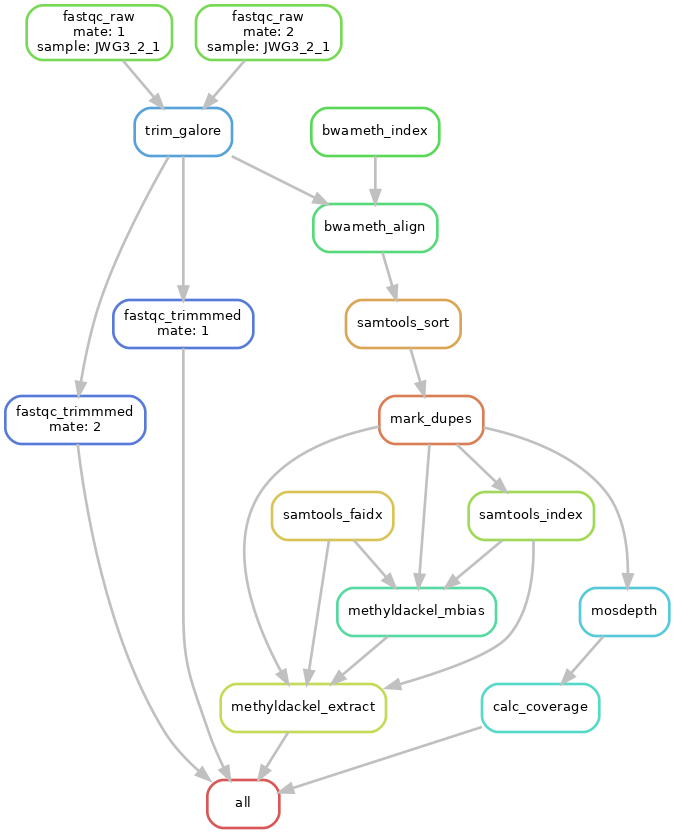

# WGBS Snakemake Workflow
[](https://zenodo.org/badge/latestdoi/189665065)

This workflow is designed to run the basic steps for a whole-genome bisulfite 
sequencing experiment. It's intended to automate the workflow for future-use and
reproducibility. Its design is explicitly simple to make it easy for users to not
only understand the order and purpose of each step, but to be able to look at the
code, figure out how it works and get it running extremely easily.

One advantage of running this through Snakemake is that it intelligently handles
threading and replaces completed processes up to the number of cores specified
at run-time. However, options for the thread count for each step are configurable
in the .yaml file.

## Dependencies
Most recent tested versions indicated. Though, more recent versions and slightly
older ones are likely a-okay!

1. [Trim Galore!](https://www.bioinformatics.babraham.ac.uk/projects/trim_galore/) v0.6.4
2. [FastQC](https://www.bioinformatics.babraham.ac.uk/projects/fastqc/) v0.11.8
3. [bwa-meth](https://github.com/brentp/bwa-meth) v0.2.2
4. [samtools](https://www.htslib.org/) v1.9
5. [Picard Tools](https://broadinstitute.github.io/picard/) v2.22.3
6. [MethylDackel](https://github.com/dpryan79/MethylDackel) v0.4
7. [Mosdepth](https://github.com/brentp/mosdepth) v0.2.9
8. [Snakemake](https://snakemake.readthedocs.io) v5.14.0
9. [Python3](https://www.python.org/) v3.5

## Quick-Start Guide
Firstly, download all the dependencies and make sure they're in your $PATH (that
you can run them from a BASH prompt). Then clone the github repo:

```shell
git clone https://github.com/groverj3/wgbs_snakemake.git
```

Edit the config.yaml file to include your sample IDs (fastq filenames,
excluding extensions, pair numbers, lane info, etc.) and a reference genome
(which may be pre-indexed). You'll definitely want to make sure that the adapter
sequence in there matches what's in your samples.

Currently, the workflow expects an R1 and R2 file for each sample. Place the
individual .fastq.gz files for R1 and R2 into the input_data directory. Once
you have all the required dependencies installed run the workflow with:

```shell
snakemake --cores {cores_here}
```

However, it is recommended to use the supplied [Docker](https://www.docker.com/)
image.

## Running With the Supplied Container
Supplied with this workflow is a Docker image built against Ubuntu 16.04. It was
vital to use this rather old version because HPCs frequently have older kernels
(especially ours at UofA), usually due to running an old version of CentOS or
similar.

You can find the image on Dockerhub here: 
https://hub.docker.com/r/groverj3/mosher_lab_wgbs

Docker is a great way to enable you to get started running the workflow without
needing to worry about dependency hell. Because, of course, the listed
dependencies have dependencies themselves. Depending on the system you're running
it may be impossible to install things globally, and it can be a pain to point
a bunch of software at conflicting versions of libraries, etc. This is especially
true as software ages.

Docker is, however, not commonly run in HPC environments due to requiring root
access. [Singularity](https://sylabs.io/) solves this issue. Though, because
Docker is more ubiquitous the image is supplied on Dockerhub. Singularity is
fully compatible with the Docker image.

For the sake of documentation, the Dockerfile used to create the Docker image is
also included in this GitHub repo.

### Running with Docker
First, clone the github repo if you haven't and enter the directory:

```shell
git clone https://github.com/groverj3/wgbs_snakemake.git
cd wgbs_snakemake
```

Next, pull the [image](https://hub.docker.com/r/groverj3/mosher_lab_wgbs) from
Dockerhub:

```shell
docker pull groverj3/mosher_lab_wgbs:ubuntu_16
```


Then, locate your samples, put them in the `input_data` folder, note the location
of your reference genome, and edit the config.yaml file as described in the
quick-start section and its embedded comments.

Finally, run the workflow with the following command from within the Snakemake
workflow's directory (where you cloned it from github):

```shell
docker run mosher_lab_wgbs -v ${system directory}:${container directory} \
    bash -c 'cd ${container directory} && snakemake --cores ${num cores}'
```

The `-v` option mounts a directory from your system to the container so it can
operate on files outside the container. For simplicity I would recommend just
connecting to a folder named the same inside the container. The snakemake
executation command must then be run inside that **same** directory within the
container. It sounds confusing, but just think of it as letting the container
see your analysis directory. the `bash -c ''` line then changes to that same
directory and runs snakemake with the number of cores you specify.

On HPCs you probably can't run Docker. So, you can instead do something very
similar with Singularity.

### Running with Singularity
First, clone the github repo if you haven't and enter the directory:

```shell
git clone https://github.com/groverj3/wgbs_snakemake.git
cd wgbs_snakemake
```

Next, pull the [image](https://hub.docker.com/r/groverj3/mosher_lab_wgbs) from
Dockerhub:

```shell
singularity pull docker://groverj3/mosher_lab_wgbs:ubuntu_16
```

This will create a file `mosher_lab_wgbs_ubuntu_16.sif` in your current
directory. There are alternative ways to manage your images from centralized
storage as well.

Then, locate your samples, put them in the `input_data` folder, note the location
of your reference genome, and edit the config.yaml file as described in the
quick-start section and its embedded comments.

Finally, run the workflow with the following command from within the Snakemake
workflow's directory (where you cloned it from github):

```shell
singularity exec mosher_lab_wgbs_ubuntu_16.sif snakemake --cores ${num cores}
```

It's actually a little more straightforward than Docker because it's assumed that
Singularity is running at the user level.

## Workflow
1. Index the reference genome with bwameth and samtools faidx
2. Quality checking, and output of sample information with FastQC
3. Adapter and quality trimming with Trim Galore!
4. Alignment to a reference genome with bwa-meth
5. Marking PCR duplicates with Picard Tools MarkDuplicates
6. Detecting methylation bias per read position with MethylDackel
7. Extracting methylation calls per position into bedGraph and methylKit formats with MethylDackel
8. Calculating depth and coverage with Mosdepth

The output from the workflow is suitable for DMR-calling or aggregation of calls
to determine % methylation per feature.



## All About the Workflow

Whole-genome bisulfite sequencing is a modification of whole-genome shotgun
sequencing designed to convert unmethylated cytosines into uracil. These uracils
are then sequenced as thymine. By tallying up the number of cytosines and
thymines for each cytosine in the reference genome you can then calculate a
percentage methylation for each annotated cytosine in your species' reference
assembly.

While it is possible to determine this by calling C -> T SNPs against a reference
there is purpose-built software for this task. The most common aligner for WGBS
is currently [Bismark](https://www.bioinformatics.babraham.ac.uk/projects/bismark/),
and in our testing it performed well. However, we decided to use a slightly
different pipeline for the purposes of our work in the
[Mosher Lab](https://cals.arizona.edu/research/mosherlab/Mosher_Lab/Home.html).
The pipeline we settled on is a combination of open source tools built around
bwameth for alignment and MethylDackel for methylation calling. In our experience
this pipeline was many times faster and resulted in a marginally higher mapping
rate. Additionally, it uses Picard Tools to mark potential PCR duplicates, and
its method for doing so is not as conservative as Bismark's internal version of
the same process. Bismark's speed has improved in more recent versions, and is
under more active development but bwameth still produces comparable results in
less time.

Use of MethylDackel allows us to determine per-position biases in terms of
methylation calls on the reads, and different ones based on read orientation.
Using some shell script hacking we can extract its recommendations for inclusion
bounds for methylation calling based on these biases and use in the methylation
calling step. This should reduce false positive or negatives based on effects of
cytosines being too close to adapters, interference from end-repair, or simply
incomplete trimming.

At the conclusion of the pipeline overall fold-coverage is calculated using the
very fast Mosdepth tool from Brent Pedersen and some python scripts.

## Citing the Workflow
Please do cite us! The included Zenodo DOI is the easiest way. Additionally, you
should consider citing the paper in which we first used this workflow:

Grover JW *et al.*. Abundant expression of maternal siRNAs is a conserved feature of seed development. 2019.
bioRxiv. https://doi.org/10.1101/866806
* Preprint: Revised manuscript submitted to PNAS
